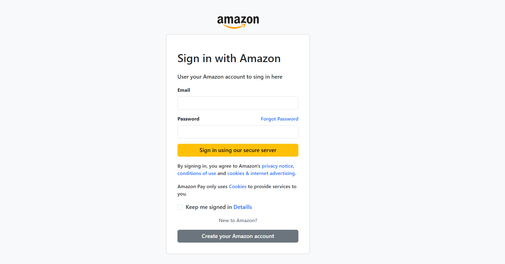

# UNIDAD 4

## 📝 Session 60

En está clase se asigno un trabajo individual para que se replicara un **Login** de cualquier marca, empresa, aplicación, entre otros.

> El resultado y el proceso fue muy divertido, más que todo se aprendió mucho en esta clase.

